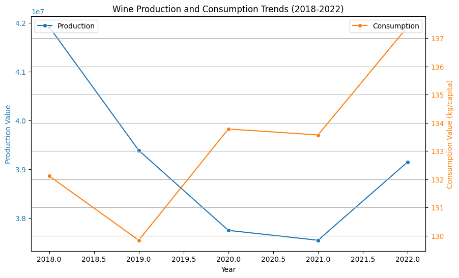

# Agrifood Data Analysis for AIGriTech’s International Expansion

Welcome to the GitHub repository for our **AI Clinic Project**! This project focuses on analyzing global wine production and consumption trends to provide actionable insights for **AIGriTech’s** international expansion strategy. 

---

## 🌟 Project Overview

**Objective:**  
To leverage data-driven insights for identifying:  
- **Surplus regions** (ideal for exports)
- **Deficit regions** (opportunities for imports)

**Key Findings:**  
- **Top Producers:** Southern Europe, Western Europe, South America
- **Top Consumers:** Southern Europe, Western Europe, Australia, and New Zealand
- **Deficit Regions:** South-eastern Asia, Eastern Africa

Our work aligns with AIGriTech’s goals of achieving sustainable growth through strategic market expansion and addressing logistical challenges.

---

## 📂 Repository Structure

```plaintext
├── data
│   ├── cleaned_data.csv     # Processed dataset used in the analysis
│   └── raw_data.csv         # Original dataset from FAO Agrifood Statistics
├── notebooks
│   ├── data_cleaning.ipynb  # Data cleaning and preprocessing scripts
│   ├── visualization.ipynb  # Exploratory data analysis and visualizations
│   └── analysis.ipynb       # Statistical analysis and trend evaluations
├── src
│   ├── utils.py             # Utility functions for data processing
│   └── main.py              # Main execution script
├── results
│   ├── insights.pdf         # Summary of key insights and findings
│   └── visuals/             # Generated charts and visualizations
├── README.md                # Project documentation (you are here)
└── LICENSE                  # License information
```

---

## 🛠️ Features

- **Data Cleaning:** Addressing missing values, removing duplicates, and merging datasets
- **Exploratory Data Analysis:** Generating summary statistics and identifying trends
- **Visualization:** Creating insightful graphs to represent production vs. consumption dynamics
- **Recommendations:** Providing actionable strategies for market expansion

---

## 🔧 Tech Stack

- **Programming Languages:** Python
- **Libraries:** Pandas, Matplotlib, Seaborn, NumPy
- **Tools:** Jupyter Notebooks
- **Data Source:** FAO Agrifood Statistics

---

## 📊 Key Visualizations

Here are some highlights of our visual insights:

1. **Wine Surplus and Deficit Across Regions**  


2. **Production vs. Consumption Correlation**  


3. **Trends (2018-2022)**  


---

## 🔍 Insights & Recommendations

### Key Insights:
- Southern Europe and Western Europe are the leading surplus regions.
- South-eastern Asia and Eastern Africa face significant deficits, indicating strong import potential.

### Recommendations:
1. Focus on exporting from surplus regions like Southern Europe.
2. Explore emerging markets in South-eastern Asia and Oceania.
3. Establish distribution hubs to optimize logistics.
4. Incorporate sustainability into marketing strategies to appeal to eco-conscious consumers.

---

## 🤝 Collaborators

This project was a team effort by:
- **Dhruvilsinh Rathod**
- **Meet Patel**
- **Hil Patel**
- **Kashish Mahavar**

Supervised by: **Anuradha Kar**  
In collaboration with: **Aivancity School for Technology, Business & Society**

---

## 🌐 Connect With Us

If you have questions, feedback, or would like to collaborate, feel free to reach out:
- **Meet Patel**: starkmeet@gmail.com | +33 669242248

---

Thank you for exploring our project! 🚀
